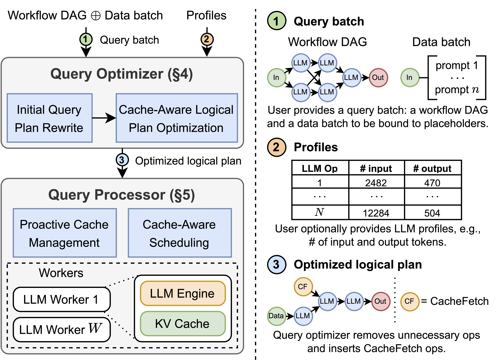

# Helium: Efficient LLM Serving for Agentic Workflows <!-- omit from toc -->

Helium is a workflow-aware serving framework for agentic LLM applications. It models agent workflows as query plans and treats LLM invocations as first-class operators to optimize interdependent calls end-to-end. By integrating proactive caching and cache-aware scheduling, Helium maximizes reuse across prompts, KV states, and intermediate results—even under speculative and parallel exploration. This data-systems approach bridges classic query optimization with LLM serving, delivering up to 1.48× speedups over state-of-the-art agent serving systems on complex workloads.

<p align="center">
  
</p>

## Table of Contents <!-- omit from toc -->

- [Project Structure](#project-structure)
- [Installation](#installation)
- [Examples](#examples)
- [Benchmarks](#benchmarks)
- [Development](#development)
  - [MacOS Development](#macos-development)
  - [Formatting and Type-Checking](#formatting-and-type-checking)

## Project Structure

```
.
├── benchmark/      # Benchmarking scripts and utilities
├── configs/        # Configuration files, e.g., LLM service configs
├── examples/       # Example code for using Helium
├── notebooks/      # Notebooks for experiments and data analysis
├── logs/           # Logs generated during execution
├── results/        # Output results from benchmarks and experiments
├── scripts/        # Utility scripts for formatting, linting, etc.
├── src/            # Source code for Helium
│   └── helium/       # Core Helium framework
├── tests/          # Unit tests
├── .env.template   # Template for environment variables
├── uv.lock         # Dependency lock file
├── pyproject.toml  # Project configuration
└── README.md       # Project documentation
```

## Installation

1. Clone the repository:

   ```bash
   git clone https://github.com/mlsys-io/helium_demo
   cd helium_demo
   ```

2. Create and activate a virtual environment. Make sure you have [uv](https://docs.astral.sh/uv/getting-started/installation/) installed.

   ```bash
   uv venv
   source .venv/bin/activate
   ```

3. Install all the dependencies:

   ```bash
   bash scripts/install_all.sh
   ```

   For MacOS environments, before running the script,

   - exclude the `flashinfer` group when installing dependencies with `uv`.
   - remove the `VLLM_PRECOMPILED_WHEEL_LOCATION` environment variable from [scripts/install_vllm.sh](./scripts/install_vllm.sh).

## Examples

We provide notebooks that demonstrate how to develop and run MA applications using Helium in [examples](./examples).

## Benchmarks

We’ve included several benchmarks to evaluate Helium against baseline systems. At present, the following are supported:

Microbenchmark Tasks:

- Map-Reduce QA
- Multi-Agent Debate QA
- Multi-Agent Reflection QA
- Iterative Refinement Generation
- Parallel Chains Generation

End-to-End Benchmark Tasks:

- Trading (investment recommendation)

Baselines:

- vLLM
- OpWise
- LangGraph
- AgentScope
- Parrot

To run the benchmarks, use the command below:

```bash
python benchmark/main.py -v
```

Results will be saved in the [results](./results) directory.

## Development

### MacOS Development

Since `vLLM` does not directly support MacOS, the `vllm-local` LLM service is not supported. We recommend using [Ollama](https://ollama.com/) to serve an LLM on MacOS.

To set up Ollama:

1. Download and install Ollama from [here](https://ollama.com/).
2. Follow the instructions provided on their website to configure and start the service.

Additionally, you can use the `openai` LLM service to connect to the Ollama server on MacOS environments. Ensure the service is properly configured to communicate with the Ollama server.

### Formatting and Type-Checking

If you’re contributing to the codebase, we highly recommend ensuring that your code is linted, formatted, and type-checked to maintain overall quality and readability. To make this easier, we’ve provided a script you can use. Simply run:

```bash
bash scripts/format.sh --all
```

Before submitting any changes, please make sure your code passes all linting and type-checking steps.
